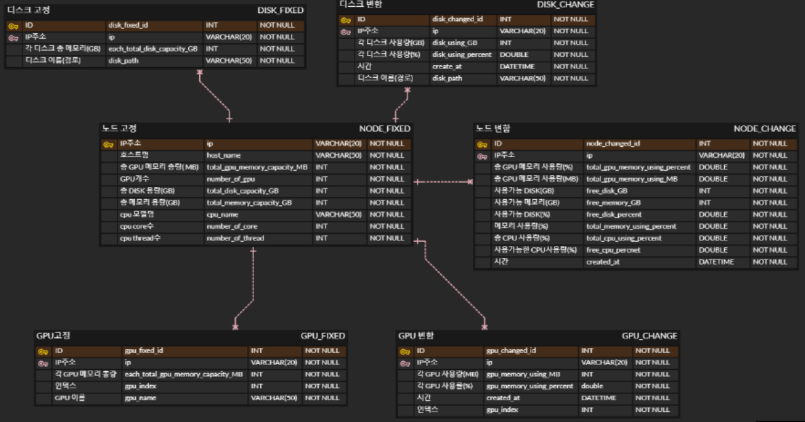
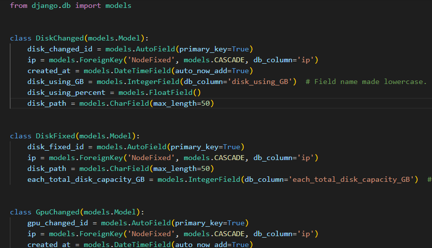
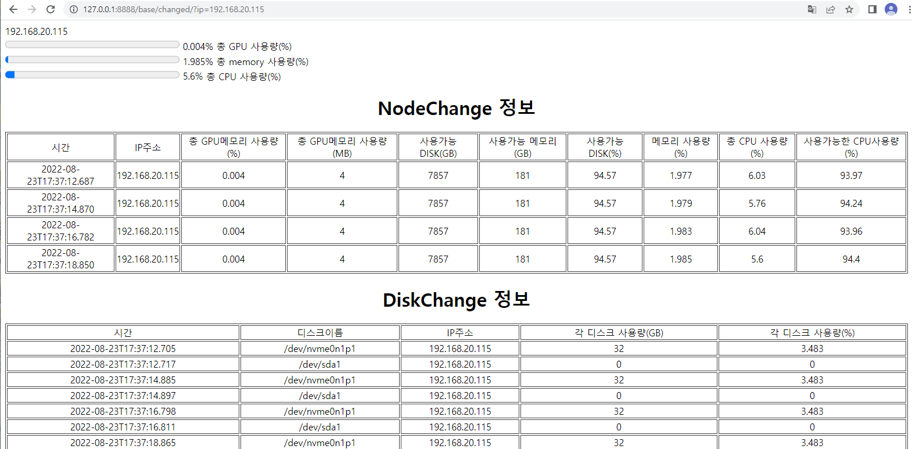
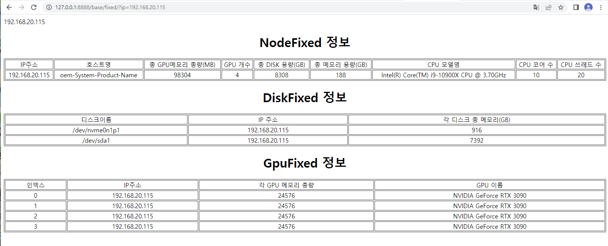

# BaroProject
바로AI 회사 프로젝트

## 프로젝트명 
***
    Hardware Monitoring Service
####
    Baro AI의 자체 소프트웨어 인프라인 클러스터링 솔루션 'TIE" 내부에서 
    Node와 그에 따른 CPU, GPU, DISK, MEMORY등의 정보를 실시간으로 불러와서 모니터링 할 수 있는 프로그램
#
## 기여자
***
    김용후(Felix)
#
## 프로젝트 기간
***
    2022.08.03 ~ 2022.08.23
#

## ERD 구상
***

####

## 형상 관리
***
####
2022-08-08

    김용후(Felix) : ERD 구상, cpu 파싱 코드 작성
    
#

####
2022-08-09
    
    김용후(Felix) : cpu 파싱 모듈화  
    
#

####
2022-08-10

    김용후(Felix) : CPU 클래스, 모듈화 수정, 테이블 수정, main.py 오류 수정

#

####
2022-08-11 

    김용후(Felix) : ssh 연결을 위한 data parsing 재작업

#

####
2022-08-12

    김용후(Felix) : Django 연결 및 models.py 작성, erd 수정

#

####
2022-08-17

    김용후(Felix) : Django db 설정, views 작성, 파싱코드와 django 서버 연결
    
#

####
2022-08-17 - 2022-08-18

    김용후(Felix) : ssh 연결 재설정, html 작성, 데이터 올바르게 전달되는지 확인, 각종 오류 수정, 예외처리
    
#

####
2022-08-19

    김용후(Felix) : 실시간으로 데이터 삽입, 비동기 처리(Ajax)방식 사용하여 새로고침 없이 실시간 데이터 출력 성공
    
#

####
2022-08-22

    김용후(Felix) : 프로그래스 바를 이용하여 cpu, gpu, memory 상태 출력
    
#

## models.py

## 웹 페이지

