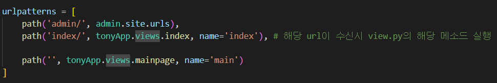
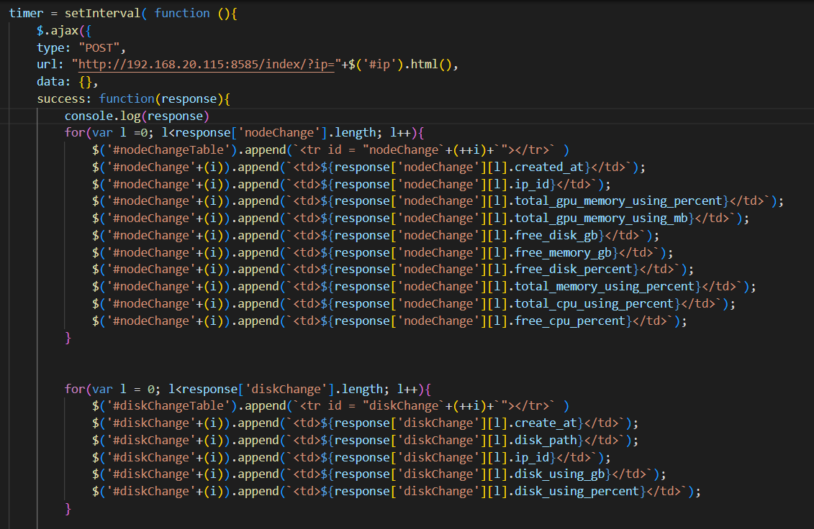

# BaroProject
바로AI 회사 프로젝트

## 프로젝트명 
***
    Hardware Monitoring Service
####
    Baro AI의 자체 소프트웨어 인프라인 클러스터링 솔루션 'TIE" 내부에서 
    Node와 그에 따른 CPU, GPU, DISK, MEMORY등의 정보를 실시간으로 불러와서 모니터링 할 수 있는 프로그램
#
## 기여자
***
    심대성(tony)
#
## 프로젝트 기간
***
    2022.08.03 ~ 2022.08.23
#

## ERD 구상
***

####

## 형상 관리
***
####
2022-08-08

    심대성(tony) : Node 고정, Node 변함 ERD 구상, 작성
    
#

####
2022-08-09
    
    심대성(tony) : GPU 클래스,모듈화  
    
#

####
2022-08-10

    심대성(tony) : GPU 클래스, 모듈화 수정, 테이블 수정, 오류 수정

#

####
2022-08-11 

    심대성(tony) : ssh 연결을 위한 data parsing 재작업

#

####
2022-08-12

    심대성(tony) : Django 연결 및 models.py 작성

#

####
2022-08-16

    심대성(tony) : Django MVC 연결 및 view 초안 출력 
    
#

####
2022-08-17 - 2022-08-18

    심대성(tony) : url 요청에 의해 views.py에서 모듈화 해놓은 python 코드 실행, 데이터 삽입 후 VIEW로 json데이터 전달 확인, 오류 수정  
    
#

####
2022-08-19

    심대성(tony) : 실시간으로 데이터 삽입, 비동기 처리(Ajax)방식 사용하여 새로고침 없이 실시간 데이터 VIEW로 출력 성공
    
#

####
2022-08-23

    심대성(tony) : 관리자 입장에서 볼 수 있도록 IP를 나눠서 출력
    
#

## models.py 일부(테이블 생성)

## 뷰와 url 연결 (urls.py 세팅)

## html에 데이터 전달(views.py)

## 뷰로 출력(일부)

## Ajax 비동기 처리(실시간 데이터 출력용)

